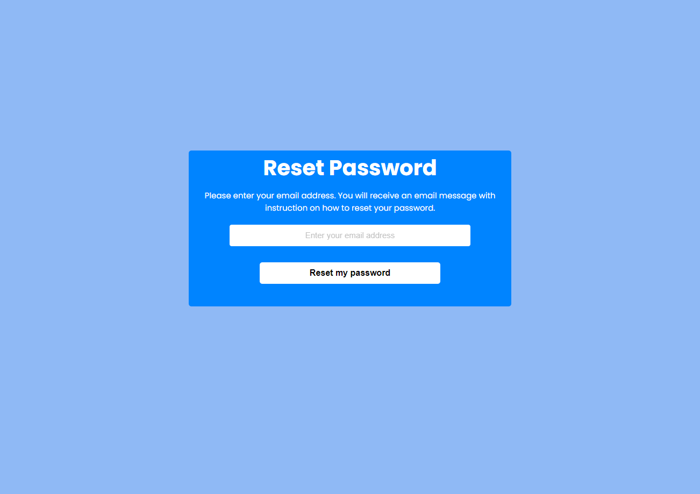

# Reset Password Form

This project is a Reset Password Form designed to practice and improve your frontend development skills using HTML and CSS. It features a straightforward interface where users can enter their email address to request a password reset.


## Technology Used ⚡

**Programming Language:** HTML5, CSS3

**Tools:** Visual Studio Code

## Features 🛠

* **Simple and Clean Interface**: While this project aims to practice responsive design, please note that it may not be fully responsive. However, the project provides a starting point for learning and experimenting with responsiveness.

* **Basic Styling**: Each card features social icons for Twitter, Instagram, and YouTube, using Font Awesome.

## Installation 🔌

Clone my repository

```bash
 git clone https://github.com/ahmadaimandev/Reset-Password.git
```
## Screenshots 🖼

<p align="center">
  
</p>


## Guidance 📚

- [W3School](https://www.w3schools.com/)
- [ChatGPT](https://chat.openai.com/)

## License 📃

This project is licensed under the MIT License. 

## Contributing

Contributions are welcome! Feel free to submit a pull request or open an issue to discuss any changes.